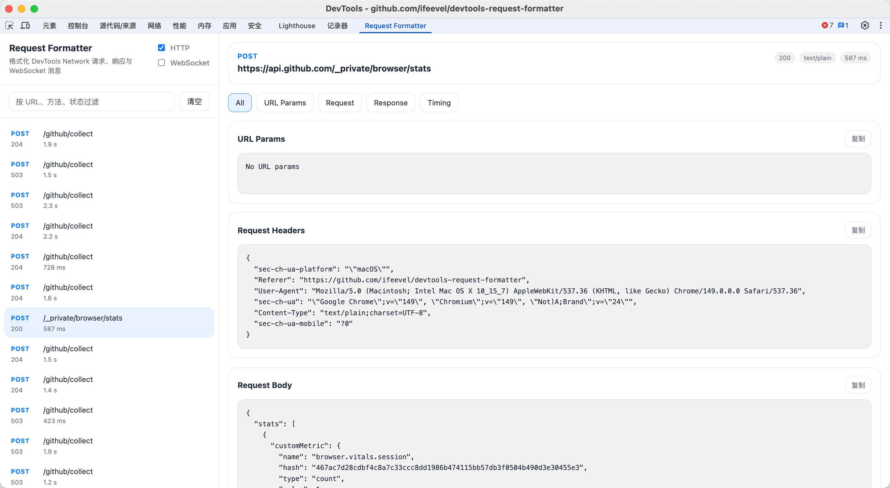

# DevTools Request Formatter

[](https://github.com/ifeevel/devtools-request-formatter/releases)
[](https://github.com/ifeevel/devtools-request-formatter/actions/workflows/release.yml)


[简体中文](./README.md) | [English](./README.EN.md)

Zero-build Chrome DevTools extension for formatting HTTP requests, responses, and WebSocket message data directly inside DevTools.



## Features

- Adds a `Request Formatter` panel to Chrome DevTools
- Automatically captures completed `Network` requests from the current page
- Displays request method, URL, status code, resource type, and duration
- Formats `URL Params`, `Request Headers`, `Request Body`, `Response Headers`, and `Response Body`
- Automatically pretty-prints `JSON` and `application/x-www-form-urlencoded` data
- Supports viewing `WebSocket` handshake details, connection status, message list, and message details
- Automatically formats `JSON` messages in `WebSocket` text frames
- Automatically follows the DevTools theme, with fallback to the system theme when the DevTools theme API is unavailable
- Supports filtering requests, pausing capture, clearing the list, and copying formatted output

## Project Structure

```text
devtools-request-formatter/
├── .github/workflows/release.yml
├── _locales/
├── assets/
├── scripts/
│   └── package.sh
├── devtools.html
├── devtools.js
├── formatters.js
├── i18n.js
├── manifest.json
├── panel.css
├── panel.html
├── panel.js
├── panel-websocket.js
├── theme.js
├── LICENSE
├── README.md
└── README.EN.md
```

The project keeps a zero-build structure, and the extension runtime entry files are located directly at the repository root.

## Local Installation

1. Open Chrome and go to `chrome://extensions/`
2. Enable Developer mode in the top-right corner
3. Click Load unpacked
4. Select the current project directory
5. Open DevTools on any page, and you will see the new `Request Formatter` panel

## Usage

1. Keep `DevTools` open
2. Switch to the `Request Formatter` panel
3. Refresh the page or trigger API requests
4. Select a request in the left-side list and view the formatted details on the right
5. Enable the `WebSocket` toggle when you need to capture WebSocket frames

## Permissions and Data Boundaries

- `clipboardWrite`: used to copy formatted content to the clipboard
- `debugger`: used to access the Chrome DevTools Protocol and capture WebSocket handshake information and message frames

Notes:
- The extension can access request data visible in the current debugging session only when you have DevTools open and are using this panel
- When `WebSocket` capture is enabled, Chrome may display a browser-level "This tab is being debugged" notice
- Whether the full response body can be read is still subject to the capabilities and limitations of the Chrome DevTools API itself

## Release

### Package Locally

```bash
bash scripts/package.sh
```

The script reads the `version` from `manifest.json` and generates the following in the `release` directory:

```text
release/devtools-request-formatter-v<version>.zip
```

### Publish to GitHub Release

1. Update the `version` in `manifest.json`
2. Commit the code and create a `tag`, for example `v0.1.0`
3. Push the `tag` to `GitHub`
4. `GitHub Actions` will automatically generate the `zip` and attach it to the `Release`

## Limitations

- Chrome only exposes requests captured while DevTools is open
- WebSocket capture depends on the `chrome.debugger` permission, and Chrome may show a browser-level debugging notice
- The current WebSocket implementation focuses on text and JSON frames; binary frames only show size and basic metadata
- Each WebSocket connection keeps at most the latest `500` messages to control panel memory and rendering cost
- Binary HTTP responses are shown as `base64` hints and are not decoded into images or archive previews
- Some cross-process, cached, or browser-internal requests may not expose the response body because of Chrome DevTools API limitations
