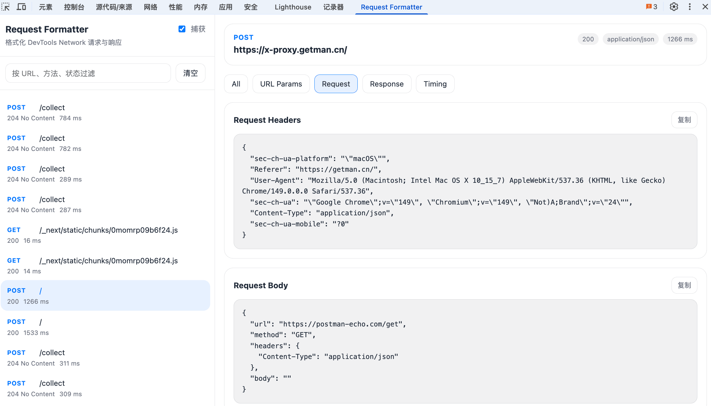

# DevTools Request Formatter

一个零构建的 Chrome DevTools 扩展，用于在 DevTools 内直接格式化 Network 请求、响应以及 WebSocket 消息数据。



## 功能

- 在 DevTools 中新增 `Request Formatter` 面板
- 自动捕获当前页面完成的 `Network` 请求
- 展示请求方法、URL、状态码、类型、耗时
- 格式化 `URL Params`、`Request Headers`、`Request Body`、`Response Headers`、`Response Body`
- 自动美化 `JSON` 与 `application/x-www-form-urlencoded` 数据
- 支持查看 `WebSocket` 握手信息、连接状态、消息列表与消息详情
- 自动格式化 `WebSocket` 文本帧中的 `JSON` 消息
- 支持过滤请求、暂停捕获、清空列表、复制格式化结果

## 项目结构

```text
devtools-request-formatter/
├── .github/workflows/release.yml
├── docs/screenshots/request-formatter-demo.png
├── scripts/package.sh
├── devtools.html
├── devtools.js
├── manifest.json
├── panel.css
├── panel.html
├── panel.js
├── LICENSE
└── README.md
```

当前项目保持零构建结构，扩展入口文件直接位于仓库根目录。

## 本地安装

1. 打开 Chrome，进入 `chrome://extensions/`
2. 开启右上角开发者模式
3. 点击加载已解压的扩展程序
4. 选择当前项目目录
5. 打开任意页面的 DevTools，即可看到新的 `Request Formatter` 面板

## 使用说明

1. 保持 `DevTools` 打开
2. 切换到 `Request Formatter` 面板
3. 刷新页面或触发接口请求
4. 在左侧列表选择请求，右侧查看格式化后的 `request` 与 `response` 等信息

## 发布

### 一键打包

项目内置了打包脚本：

```bash
bash scripts/package.sh
```

脚本会读取 `manifest.json` 中的 `version`，并在 `release` 目录生成：

```text
release/devtools-request-formatter-v<version>.zip
```

压缩包根目录会直接包含 `manifest.json`，符合 Chrome 扩展上传要求。

### 发布到 GitHub Release

1. 更新 `manifest.json` 中的 `version`
2. 提交代码并打 `tag`，例如 `v0.1.0`
3. 推送 `tag` 到 `GitHub`
4. `GitHub Actions` 会自动生成 `zip` 并附加到 `Release`

如果你想手动发布，也可以先执行打包脚本，再把 `release` 目录里的 `zip` 上传到 `GitHub Release` 附件。

### 发布到 Chrome Web Store

1. 运行 `bash scripts/package.sh`
2. 打开 `Chrome Web Store Developer Dashboard`
3. 上传 `release` 目录中的 `zip` 包
4. 完善商店描述、图标和截图后提交审核

## 限制

- Chrome 只会暴露 `DevTools` 打开期间捕获到的请求
- `WebSocket` 消息捕获依赖 `chrome.debugger` 权限；启用后 Chrome 可能会显示“此标签页正在被调试”的提示
- 当前 `WebSocket` v1 版本仅对文本帧和 JSON 帧做格式化展示；二进制帧只显示大小与基础信息
- `WebSocket` 消息列表最多保留每个连接最近 `500` 条消息，以避免面板卡顿
- 二进制响应会以 `base64` 提示展示，不做图片、压缩包等内容解析
- 某些跨进程、缓存或浏览器内部请求可能无法读取 `response body`，这是 `Chrome DevTools API` 的限制
